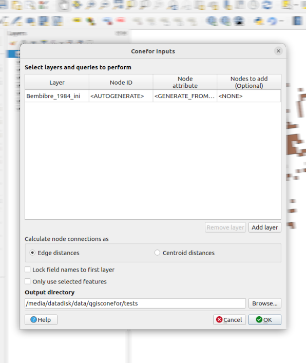

# QGIS Conefor plugin

A [QGIS] plugin for integrating with [Conefor]. 

[QGIS]: https://qgis.org
[Conefor]: http://conefor.org/

---

**Documentation:** <https://ricardogsilva.github.io/qgisconefor>

**Source code:** <https://github.com/ricardogsilva/qgisconefor>

---

This is a QGIS plugin to integrate Conefor into QGIS.

It provides a bridge between QGIS and Conefor, allowing you to:

- Prepare inputs for Conefor from geospatial files
- Run Conefor's landscape connectivity analysis algorithms from inside QGIS, through 
  its [Processing framework](https://docs.qgis.org/3.34/en/docs/user_manual/processing/index.html). The aim is 
  to provide a convenient environment for landscape and habitat analysis. Conefor algorithms can be directly 
  integrated in more complex workflows through models and scripts and use all the other GIS algorithms 
  included in the processing framework.

The plugin also includes a GUI window which can be used solely for preparing inputs to use by Conefor as a separate
application.

## Installation

This plugin is available for installation via the main QGIS plugin repository. Inside QGIS,
navigate to _Plugins -> Manage and Install Plugins..._, then search for **Conefor** and install it

??? info "Extra - Installing from our custom plugin repo"

    In addition to installing from the official QGIS plugin repository, this plugin is also available for install from 
    our own custom plugin repo. This may occasionally have a newer version
    than the one present in the official QGIS repo (the reason being that the QGIS repo is manually curated and it
    usually takes a while before a new version is approved by its maintainers)

    It is available at:
    
    <https://ricardogsilva.github.io/qgisconefor/repo/plugins.xml>
    
    1. Add this custom repository inside QGIS Plugin Manager
    1. Refresh the list of available plugins
    1. Search for a plugin named **Conefor**
    1. Install it!

Proceed to the [User guide](user-guide.md) section for next steps.

## License

This plugin is distributed under the terms of the
[GNU General Public License version 3](https://www.gnu.org/licenses/gpl-3.0.en.html)
