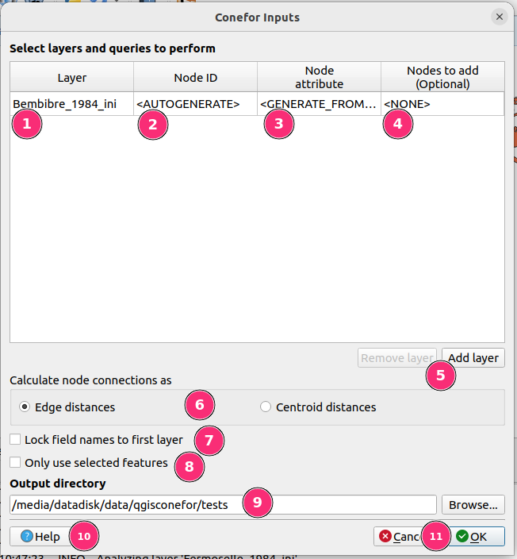
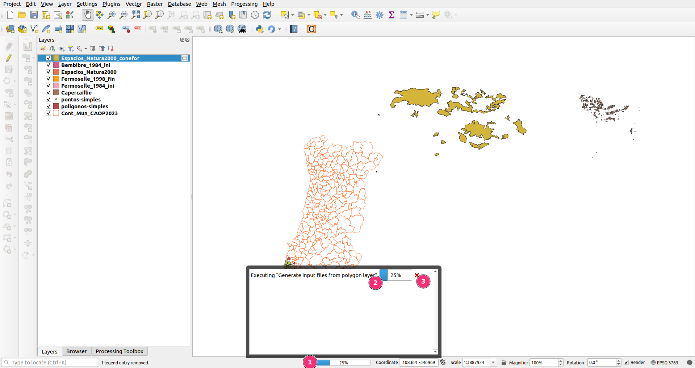
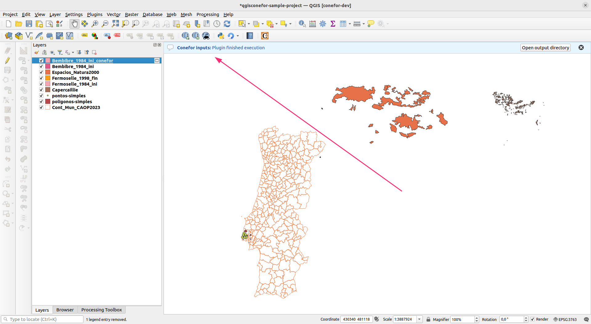
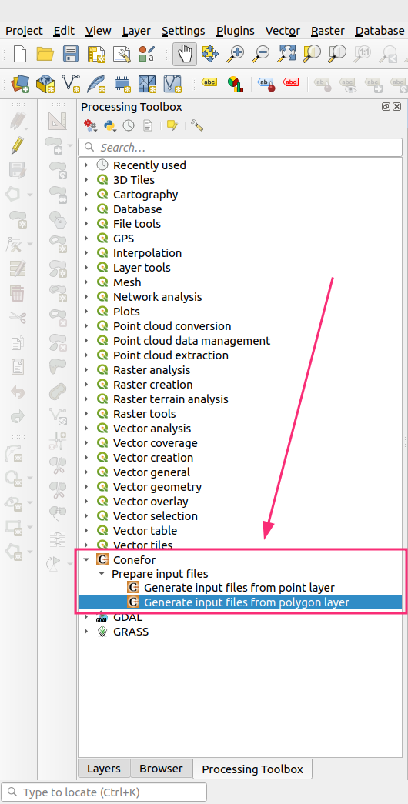

# User guide

**QGIS Conefor** is a plugin for the Open Source GIS software [QGIS](http://qgis.org) that allows to interact with 
the [Conefor](http://conefor.org) application.

This plugin includes an interface which can be used for preparing inputs to use by Conefor as a separate
application.

??? example "Running Conefor algorithms from inside QGIS"

    This plugin also aims to provide a bridge between QGIS and Conefor, allowing you to run Conefor's landscape 
    connectivity analysis algorithms from inside QGIS, through the QGIS Processing framework/toolbox. 

    **This feature is still work-in-progress** and is therefore not available yet. When ready, it will present a 
    convenient environment for landscape and habitat analysis, enabling Conefor algorithms to be directly integrated 
    in more complex workflows through models and scripts and use all other GIS algorithms included in the QGIS 
    processing framework/toolbox.

    Stay tuned for future updates on the landing of this feature.

Once installed, the plugin tools can be reached in different places:

- From the main menu: _vector > Conefor inputs_
- The _Vector_ toolbar also shows a button to launch the plugin dialog
- _Processing_ toolbox (see below, "Using Conefor inside QGIS" paragraph)

??? note "QGIS toolbars"

    In QGIS the toolbars can be activated/deactivated by using the following menu:

    _View > toolbars_

	The content of a toolbar may vary depending on what tools/plugins are installed/active in a specific QGIS 
    installation. The Conefor plugin is part of the _Vector Toolbar_ toolbar.

## Usage

[//]: # (This plugin has two main intended usage workflows:)

[//]: # ()
[//]: # (1. As a means for generating the Conefor input files &#40;nodes and connections&#41; from geospatial layers and then running )

[//]: # (   the standalone Conefor application with the these input files. For this you can either:)

[//]: # ()
[//]: # (   - Use the plugin's main dialog)

[//]: # (   - Use the Processing algorithms present in _Processing toolbox > Conefor > Prepare input files_)

[//]: # ()
[//]: # (2. As way to run the Conefor application from inside QGIS. In this workflow you can both prepare the Conefor input files)

[//]: # (   and run the Conefor analysis by combining the Processing algorithms present in _Processing toolbox > Conefor_)

This plugin is used for generating the Conefor input files (nodes and connections) from geospatial layers and then 
running the standalone Conefor application with the these input files. For this you can either:

- Use the plugin's main dialog
- Use the Processing algorithms present in _Processing toolbox > Conefor > Prepare input files_

## Preparing inputs for Conefor

### Using the dedicated Conefor plugin dialog

The icon/shortcut available in the _Vector > Conefor inputs_ menu or in the _Vector_ toolbar provides access to a
dialog that allows you to create the input files to be then processed with the Conefor application. 

The dialog allows to compute distance analysis and node (feature) queries:

- Distance from edges
- Distance from centroids
- Compute area of polygons
- Extract one attribute

The results are placed into (separate) text files (with the .txt file extension) inside an output folder.

!!! tip
    For information on how you would use the plugin-generated files as inputs to Conefor, please see the 
    [Conefor user manual]. 

[Conefor user manual]: http://www.conefor.org/files/usuarios/Manual_Conefor_26.pdf

The dialog looks like this:

1.  **Layer selector** - When clicked, this turns into a combobox, allowing you to select one of the layers that are 
    currently loaded in QGIS as the target for Conefor inputs generation;

2.  **Node ID selector** - Select one of the attributes of the layer to be used as the Conefor node identifier. Only 
    attributes of type integer are acceptable. Moreover, in order for the attribute to be usable as a node identifier, 
    each feature in the input layer must have a unique value. 

    Alternatively to selecting an existing layer attribute, you may also choose the `<AUTOGENERATE>` option. This will 
    result in the creation of a new in-memory layer named `{layer-name}_conefor` (in which `{layer-name}` is the name 
    of the original layer), which is a copy of the original input layer, with the addition of a new column 
    named `conefor_node_id`. This will allow you to match the node ids generated by the plugin to their 
    corresponding layer features. 

    !!! tip
        Don't forget to save this new layer if you want to keep it, as in-memory layers are 
        deleted when QGIS closes!

3.  **Node attribute selector** - Select one of the attributes of the layer to be used as the Conefor attribute. Only 
    numeric attributes are acceptable.

    Similarly to the Node ID selector, you may choose the `<GENERATE_FROM_AREA>` option, which will result in the 
    creation of a new in-memory layer with a new column named `conefor_node_attribute(area)`. This column has the area 
    of each feature, which is then used as the Conefor node attribute.

    !!! tip
        You can combine both the autogeneration of a node id and the autogeneration of a node attribute, which would 
        result in the generation of a single in-memory QGIS layer with a copy of the original layer and the addition of
        the two `conefor_node_id` and `conefor_node_attribute(area)` columns.

    ??? info
        Autogeneration of the Conefor node attribute by using feature areas reuses the following QGIS Processing 
        toolbox algorithms:

        -  [Add geometry attributes](https://docs.qgis.org/testing/en/docs/user_manual/processing_algs/qgis/vectorgeometry.html#add-geometry-attributes) - Area is calculated using the `ellispoidal` option
        -  [Drop field(s)](https://docs.qgis.org/testing/en/docs/user_manual/processing_algs/qgis/vectortable.html#qgisdeletecolumn)
        -  [Rename field](https://docs.qgis.org/testing/en/docs/user_manual/processing_algs/qgis/vectortable.html#qgisrenametablefield)

4. **Nodes to add selector** - You can optionally select one of the input layer's attributes that should be used as the
   Conefor _nodes to add_ field. This attribute must only have integer values of `0` and `1`. Read more this feature on
   the [Conefor user manual].

5.  **Add/Remove layer buttons** - These buttons allow you to add and remove layers to be processed. Note that the 
    `Remove layer` button always removes the last layer of the list

6.  **Node distance method selector** - These radio buttons allow you to select one distance calculation method, which
    will be used to generate the Conefor distances file. Choose one of:

    -  `Edge distances` - Calculates distances between pairs of features by measuring the distance between their 
       closest edges
    -  `Centroid distances` - Calculates distances between pairs of features by measuring the distance between their 
       geometric centroids
    
    !!! info "Distance calculation and Coordinate Reference Systems (CRS)"
        When calculating distances it is a good idea to ensure that layers use a projected CRS. 

        In this plugin, if the input layer's CRS is projected, then distance calculation uses it directly. On the 
        contrary, if the CRS of the layer is geographic, the plugin will fallback to using the CRS of the QGIS 
        project - it simply transforms each input feature into the QGIS project's CRS (expecting it to be projected, 
        but without checking) perform distance calculations.

        If your input layers use a geographic CRS, such as WGS84 (EPSG:4326), you should either reproject them first 
        or set an appropriate CRS in the QGIS project settings.

7.  **Lock field names to first layer selector** - If you add a large number of layers with similar names for 
    their corresponding attributes, you can opt to specify the `node id`/`node attribute`/`nodes to add` values for the
    first layer and have this selection be automatically replicated to all layers in the list.

8.  **Only use selected features selector** - Restrict the Conefor input files to contain information related to the 
    currently selected features

9.  **Output directory selector** - Choose the output directory for the generated Conefor node and connection files. 
    The output files will be put inside the selected directory and will be named like:

    -  `nodes_{node-column-name}_{layer-name}[_{increment}].txt`
    -  `distances_{edges | centroids}_{layer-name}[_{increment}].txt`
    
    Where `_{increment}` may be present if there is already another file with the same name, in which case the increment
    is simple numeric increment, used to diferentiate between them.

    For example, if a layer is named `espacios_natura2000`, the possible output name combinations will be:

    -  `nodes_conefor_node_attribute_(area)_espacios_natura2000.txt`
    -  `nodes_NODE_ATTRIBUTE_espacios_natura2000.txt`
    -  `nodes_NODE_ATTRIBUTE_espacios_natura2000_2.txt`
    -  `distances_centroids_espacios_natura2000.txt`
    -  `distances_edges_espacios_natura2000.txt`
    -  `distances_edges_espacios_natura2000_2.txt`

10. **Plugin help button** - Press the `Help` button to be taken to the homepage of the plugin, where you can find 
    this user guide

11. **OK/Cancel button** - Use the `OK` button to proceed with the generation of the Conefor input files or the `Cancel`
    button to close the plugin dialog without performing any further action

#### Plugin execution

When running, the plugin dialog will close itself and the processing will be taking place as a background task, 
with the progress being displayed in QGIS status bar (number 1 in the image below).

Clicking on the progress indicator opens up a small pop-up dialog where you can inspect the progress with a bit 
more detail (see number 2 in the image) and cancel ongoing calculations (number 3 in the image). 

When finished, the plugin displays a notification in the main QGIS message bar to let you know its work is done. 
If something went wrong, it will show an error description.

##### Geometry-related errors

Whenever an input layer has invalid geometries the plugin will use the same strategy as other Processing algorithms, 
and which can be configured in the main QGIS settings. Starting in the QGIS main menu, navigate to 

_Settings -> Options... -> Processing -> General -> Invalid features filtering_

There are several options to choose, which affect how the QGIS Processing framework deals with invalid geometries:

- Stop algorithm execution when a geometry is invalid
- Do not filter (better performance)
- Skip (ignore) features with invalid geometries

Choose the option which is more appropriate for your use case, keeping in mind that for the Conefor plugin, valid 
geometries are only needed when autogenerating the node attribute based on the area of a feature.

!!! warning

    The settings which control how the Processing framework deal with invalid geometries apply to QGIS as a whole.

### Using the Processing toolbox algorithms

This plugin's execution code is implemented as set of QGIS Processing algorithms. Therefore, regardless of if you are
using the custom plugin dialog, or the dialogs shown via the Processing toolbox, the code runs in the same way. This 
means that execution options are mostly the same, with the notable difference that running via Processing uses a generic
dialog that gets automatically created by QGIS.

!!! tip

    Running via Processing also unlocks integrating this plugin with other algorithms, perhaps by creating complex 
    Processing workflows with its Model Designer, or via custom scripts.

    The [QGIS documentation has a comprehensive section on Processing](https://docs.qgis.org/3.34/en/docs/user_manual/processing/index.html).

Looking at the QGIS Processing Toolbox panel, you will find a section named **Conefor**. Expanding it will show the 
following structure:

-  `Prepare input files -> Generate input files from point layer` 

-  `Prepare input files -> Generate input files from polygon layer`

Note that even though the custom dialog only allows the processing of vector layers that have _Polygon_ geometries, 
which is the main use case for this plugin, using the Processing toolbox allows you to make use of layers with _Point_ 
geometries too, if needed.

!!! tip

    You can enable the Processing toolbox by navigating to _Processing -> toolbox_ in the QGIS main menu

When choosing any of these two algorithms a new dialog pops up, with a set of user interface controls that mimick what 
has been described above in the [section about the custom plugin dialog](#using-the-dedicated-conefor-plugin-dialog)

[//]: # (## Using Conefor inside QGIS)

[//]: # ()
[//]: # (The files created with the tool described in the previous section are meant to eventually be processed using the Conefor )

[//]: # (application, with either its graphical user interface or using the command line version.)

[//]: # ()
[//]: # (However, the qgisconefor plugin also provdes a set of QGIS Processing algorithms to perform the Conefor analysis )

[//]: # (directly inside the QGIS environment. This feature uses under the hood the command line version of Conefor, thus )

[//]: # (requiring that you have it installed on your system.)

[//]: # ()
[//]: # (This approach has the advantage of providing integration between QGIS' multiple geoprocessing/analysis/statistics tools)

[//]: # (and Conefor. It becomes possible to use Conefor analysis either:)

[//]: # ()
[//]: # (- As a standalone tool inside QGIS)

[//]: # (- For batch processing of multiple files)

[//]: # (- Chaining together multiple QGIS Processing tools by means of building a workflow with the Processing model builder)

[//]: # (- Storing complex workflows that use Conefor for reuse and sharing)

[//]: # ()
[//]: # ()
[//]: # (### Configure the Conefor Processing provider)

[//]: # ()
[//]: # (As mentioned above, in order to use Conefor inside QGIS you must have its command-line version already installed on )

[//]: # (your system. Follow the [Conefor download instructions]&#40;http://conefor.org/coneforsensinode.html&#41; for more information)

[//]: # (on how to install the Conefor command line version.)

[//]: # ()
[//]: # (In QGIS, you need to specify the path to the Conefor application by going to:)

[//]: # ()
[//]: # (_Settings > Options... > Processing > Providers > Conefor > Conefor executable path_)

[//]: # ()
[//]: # (and then providing the path on your system where Conefor is installed.)

[//]: # ()
[//]: # ()
[//]: # (### Using the Conefor Processing algorithms)

[//]: # ()
[//]: # (In the QGIS Processing toolbox, look for the **Conefor** section. )

[//]: # ()
[//]: # (??? Info - Enabling the QGIS Processing toolbox)

[//]: # ()
[//]: # (    If not already visible, you can enable it by going QGIS main menu _Processing > Toolbox_ )

[//]: # ()
[//]: # ()
[//]: # (The QGIS/Processing Conefor section is organized in groups, each one containing one or more tools:)

[//]: # ()
[//]: # (- _Binary indices_ - Contains algorithms for using Conefor's binary indices: BC, BCIIC, CCP, etc.)

[//]: # ()
[//]: # (- _Prepare input files_ - Contains algorithms for preparing the Conefor nodes and connection input files. These perform)

[//]: # (  the same task as the plugin's main dialog, which was described above)

[//]: # ()
[//]: # (- _Probability indices &#40;distance based&#41;_ - Contains algorithms for using Conefor's probability indices)

[//]: # (- _Probability indices &#40;probability based&#41;_ - Contains algorithms for using Conefor's probability indices)

[//]: # ()
[//]: # (- _Utilities_)

[//]: # ()
[//]: # (Technically the tools in the _Prepare input files_ and _Utilities_ sections do not require the Conefor command line )

[//]: # (tool to be installed, as they are meant to create the input files to be processed with the Conefor program )

[//]: # (&#40;as discussed above. The advantages of having these tools inside the QGIS Processing toolbox are the ones already )

[//]: # (cited, especially the possibility to run them in batch mode or as part of a larger workflow.)

[//]: # ()
[//]: # (When double clicking one of the tools a dialog is presented to the user, this allows to choose the inputs and )

[//]: # (parameters for that particular tasks. Please read the Conefor user manual for information related to the various Conefor)

[//]: # (indices and parameters.)

[//]: # ()
[//]: # ()
[//]: # (#### Running an algorithm in batch mode)

[//]: # ()
[//]: # (Since the Conefor algorithms are exposed inside the QGIS Processing toolbox, they can be ran in batch mode, just like)

[//]: # (all other toolbox tools. The official QGIS documentation has a section on how to use the batch mode:)

[//]: # ()
[//]: # (https://docs.qgis.org/3.34/en/docs/user_manual/processing/batch.html)

[//]: # ()
[//]: # ()
[//]: # (#### Creating Processing workflows with the model builder)

[//]: # ()
[//]: # (Since the Conefor algorithms are exposed inside the QGIS Processing toolbox, they can be integrated into larger )

[//]: # (workflows. The official QGIS documentation has a section on how to use the processing Model designer:)

[//]: # ()
[//]: # (https://docs.qgis.org/3.34/en/docs/user_manual/processing/modeler.html)
