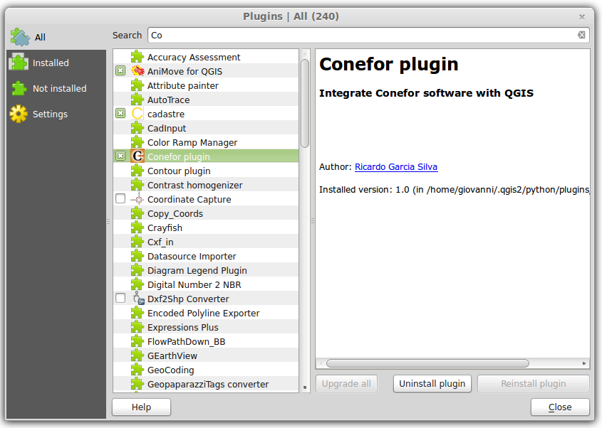
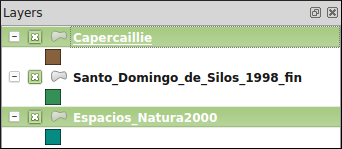
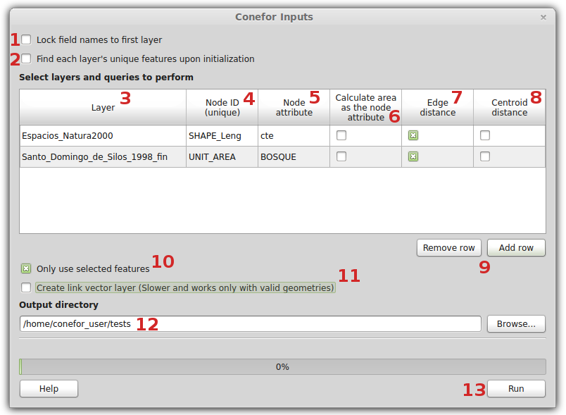
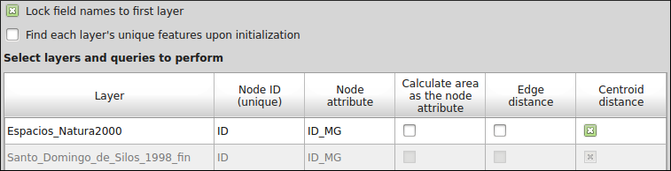
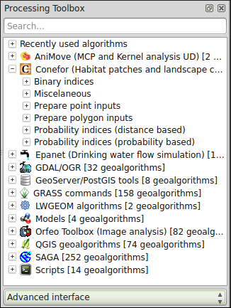
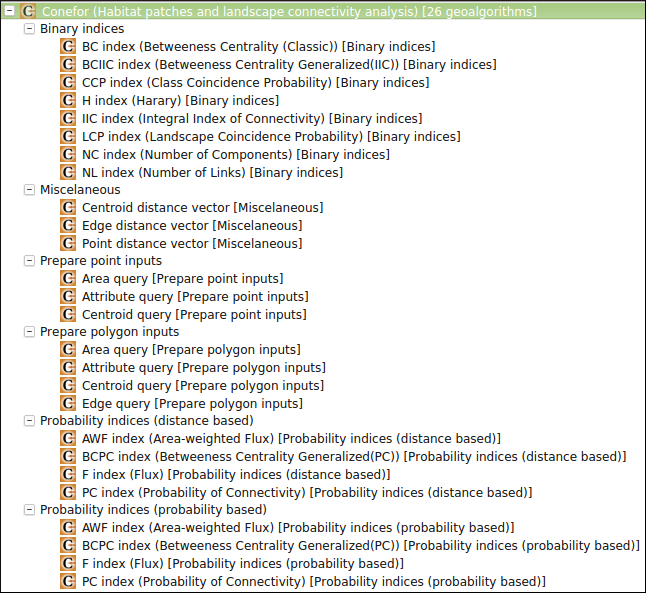
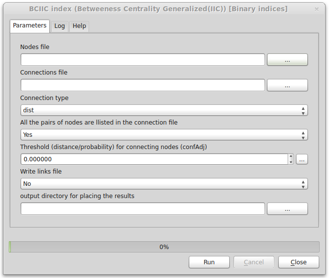
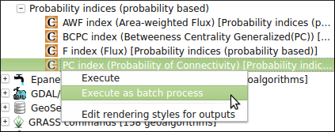
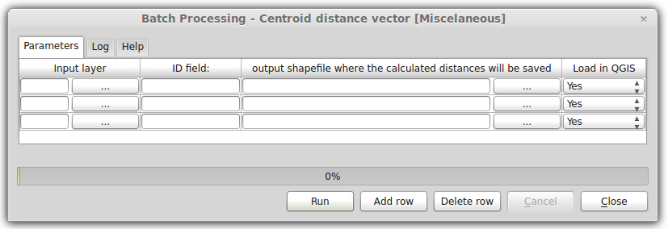
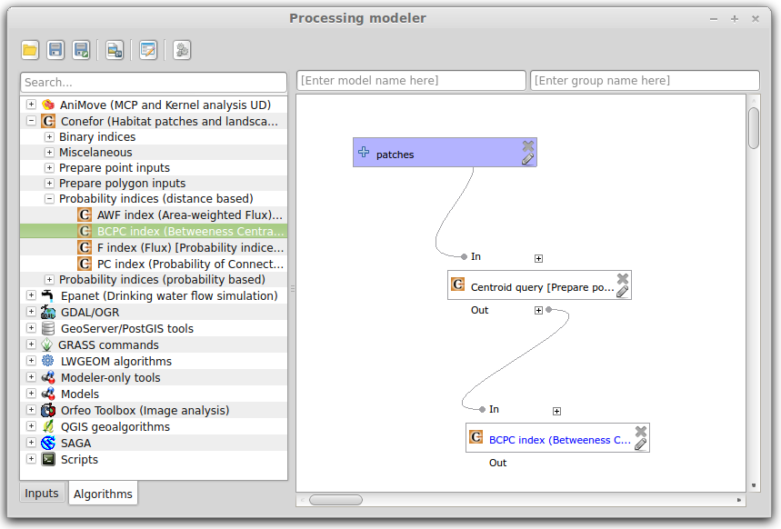

+++++++++++++++++++++++++++++++++++++++++++++++++++++++++
QGIS Conefor (for QGIS 2.x)
+++++++++++++++++++++++++++++++++++++++++++++++++++++++++

Foreword
===============================================================================

**QGIS Conefor** is a plugin for the Open Source GIS software `QGIS <http://qgis.org/>`_ (version 2.x) that allows to interact with the `Conefor <http://conefor.org/>`_ application.

This plugin provides a bridge between QGIS and Conefor, allowing you to run all of Conefor's landscape connectivity analysis algorithms from inside QGIS, through the QGIS Processing framework/toolbox. This provides a very convenient environment for landscape and habitat analysis. Conefor algorithms can be directly integrated in more complex workflows through models and scripts and use all of the other GIS algorithms included in the QGIS processing framework/toolbox.

The plugin also includes an interface which can be used solely for preparing inputs to use by Conefor as a separate application.

Installation
===============================================================================

The plugin is available in the official QGIS plugins repository. It can be searched and installed directly from within QGIS using the plugin installer (Menu: **plugins > manage and install plugins**)

|

|

.. note::

	Alternatively the plugin plugin can be **manually** installed:

	* Download the plugin archive (zip file) from the Conefor site (link), or from the QGIS plugins repository (link) or from QGIS Conefor Github repository (link)

	* Unzip the archive and place the resulting folder (*qgisconefor*) inside the QGIS plugins folder

	* Under MS Windows the QGIS plugins folder is:

		**c:\\users\\yourusername\\.qgis2\\python\\plugins\\** 
	
	* Under GNU/Linux the QGIS plugins folder is:

	 	**/home/yourusername/.qgis2/python/plugins/** 

	* Check (eventually after restarting QGIS) if the plugin is active in the QGIS plugin installer (Menu: **plugins > manage and install plugins**)

	|

		.. image:: img/active.png
	  	   :align: center
		   :width: 15em

Once installed the plugin tools can be reached in different places:

	* Menu: **vector > conefor inputs**

	* The *Vector* toolbar

	* The *Processing* toolbox (see below, "*Using Conefor inside QGIS*" paragraph)

.. note::

	In QGIS the toolbars can be activated/deactivated by using the following menu:

		**view > toolbars** 

	The content of a toolbar may vary depending on what tools/plugins are installed/active in a specific QGIS installation, example:

	|

		.. image:: img/toolbar.png
	  	   :align: center
		   :width: 15em

Usage
===============================================================================

Preparing the inputs for post-processing with Conefor
_______________________________________________________________________________

The icon/shortcut available in the **vector > conefor inputs** menu or in the **Vector** toolbar gives the user access to an interface that allows the user to prepare/create the input files to be then processed with the Conefor application (see the `Conefor user manual <http://www.conefor.org/files/usuarios/Manual_Conefor_26.pdf>`_). This tool [1]_ is similar in its functionalities to the old "Conefor Inputs" QGIS plugin, the one that used to work in older QGIS releases (up to 1.8).

.. [1] Unlike the old version of the plugin, this tool accepts many different input (vector) formats, all the ones supported by QGIS. Among the others (but not limited to): ESRI Shapefiles, PostGIS, Spatialite, CSV, KML, GPX, ESRI Personal/File Geodatabases. See: http://www.gdal.org/ogr/ogr_formats.html for a complete list.

The tool allows to compute distance analysis and node (feature) queries:

	* distance from edges (for polygon layers)

	* distance from centroids (for polygon layers)

	* distance from points (for point layers)

	* compute area of polygons (for polygon layers)

	* extract one attribute

The results are placed into (separate) text files (with the .txt file extension) inside an output folder chosen by the user.

For distance queries is available the option to compute also a vector layer (in ESRI Shapefile format) that represents the segments with the minimum distance between the input features.

When opening the tool, by default it loads just the first available layer or the selected ones (in the **Layers** QGIS panel). If you want to process multiple layers then makes the proper layer selection in QGIS main window (**Layers** panel) by using the CTRL key.

	|

For example, the above selection will load inside the tool the "*Capercaille*" and "*Espacios_Natura_2000*" layers but not the "*Santo_Domingo_de_Silos_1998_fin*" one.

This is how the interface looks like:

	|

The options are described here below:

1. **Lock field names to first layer**: before running any analysis/query, for each layer it is mandatory to select a few options (a unique ID among the others, see below for details). If the number of layers to be analyzed/queried is high then this can become a tedious operation. By checking this option the user can force the tool to assume that the same analysis/queries have to be run for all the layers. The tool will also assume that all the layers have a unique ID with the same name. See image below:

	|

2. **Find each layer's unique features upon initialization**: for each layer the user must select an attribute (by double clicking the option "NODE ID (unique)") that represents an unique ID for the features of that particlar layer. When this option is active the tool scans the tables of attributes of input layers and checks for columns that are appropriate as unique IDs. This columns are then the only ones available when double clicking "NODE ID (unique)". Scanning tables for unique IDs can take a while (depends on how many records input ayers have) but it is useful when the user daon't know what attribute can be used as a unique ID.

3. **Layer**: the list of loaded layers to be analyzed/queried. If the user mistakenly loads a layer that is not to be used, then it can double click on its name and a dropdown will show, allowing to choose any other proper (point tot polygon) layer loaded in the QGIS project.

4. **NODE ID (unique)**: this option allows to choose what is the attribute to be used as unique ID.

5. **Node Attribute**: this option allows the user to query (extract) one attribute from the table of attributes of the input layer. Results will be placed in a text file beside the "NODE ID" values.

6. **Calculated area as the node attribute**: this option is only available when the input layer is a polygon one. When this option is active an output text file will be created and it will contain the area (in map units) of each feature.

7. **Edge distance**: this option is only available when the input layer is a polygon one. When this option is active an output text file will be created and it will contain the minimum distance between the edges (boundaries) of each feature.

8. **Centroid distance**: this option is available when the input layer is a polygon one or a point one. When this option is active an output text file will be created and it will contain the minimum distance between the centroids of polygon features or between the point features.

9. **Remove Row/Add Row** buttons: this buttons allow the user to remove one input layer or to add a new one that was previously not selected when the tool was open.

10. **Use only selected features**: by default the analysis/queries are run in all the features of all input layers. If a selection is made in the QGIS canvas (in one or more input layers) and this option is checked, then the analysis/queries will be run only using the selected features.

11. **Create link vector layer**: when this option is active (together with one distance analysis/query) then an additional output is created. The additional output is vector layer that contains as attributes the distances between features (edges and/or centroids/points) and as geometries the segments (lines) that represent such distances. When this option is active the analysis can take a while (depends on the number of features in input layers), moreover the (polygon) input layer must contain only valid geometries [2]_.

12. **Output directory**: the folder where output files where be placed.

13. **Run** button: to run the analisys/queries. The output file names contain the type of query and the layer name. For example, if the input file name is "espacios_natura2000" (polygon vector layer) then all the possible outputs will be:

	* distances_centroids_espacios_natura2000.txt
	* distances_edges_espacios_natura2000.txt
	* nodes_calculated_area_espacios_natura2000.txt
	* nodes_NODE_ATTRIBUTE_espacios_natura2000.txt
	* link_vector_layers/centroid_links_espacios_natura2000.shp
	* link_vector_layers/edge_links_espacios_natura2000.shp

|

.. note::

	When running multiple times the same analysis/query then the output files will not be overwritten, instead a underscore and a progressive number is added at the end of the output file 	name, for example:

	* distances_centroids_espacios_natura2000_2.txt

.. [2] In case of invalid geometries QGIS has a number of tools that allow to check/fix them. Please refer to the `QGIS manual <http://www.qgis.org/en/docs/index.html#20>`_ for details.

Using Conefor inside QGIS
_______________________________________________________________________________

The files created with the tool described in the previous paragraph are meant to be post processed using the Conefor application using the version with the graphical user interface or using the command line version.

This new version of the QGIS Conefor plugin allows the users to process this files directly in the QGIS environment. This new feature uses under the hood the command line version od Conefor, but provides to the users easy to use tools with graphical user interfaces. 

This approach has a few advantages:

	* the Conefor tools become available in an environment (the QGIS *Processing* toolbox) that features hundreds of geoprocessing/analysis/statistics tools
	
	* the Conefor tools can be used inside a graphical model builder where they can be mixed with any other tool available in the QGIS *Processing* toolbox

	* models that make use of Conefor (complete or partial) can be saved as model files and shared/distributed

	* any Conefor tool can be run in batch mode

Getting Started
+++++++++++++++++++++++++++++++++++++++++++++++++++++++++++++++++++++++++++++++

The first step is to activate and configure the Conefor provider in the QGIS *Processing* toolbox options.

	* follow the **Processing > Options and Configrations** menu, a panel will show

	* open the **providers > Conefor (Habitat patches and landscape connectivity analysis)** group

	* verify that the **activate** checkbox is selected

	* Fill the **Path to conefor.exe** paramater: this parameter is mandatory

	|

.. image:: img/cli.png
   :align: center
   :width: 25em

.. note::

	The command line version of Conefor is available only for the Windows Operating system. The binary/executable file is called "conefor.exe". Anyway under other Operating systems such GNU/Linux it has been tested that the Windows version works fine using the `Wine <http://www.winehq.org/>`_ emulator. When installed in a GNU/Linux environment the QGIS Conefor plugin checks for the presence of the Wine emulator when running Conefor processes.

The second step is to open the *Processing* toolbox (if not already) by clicking the QGIS menu entry **Processing > Toolbox**. Be also sure that the toolbox is showing the tool using its **advanced interface** (at the bottom of the toolbox there is a button that allows to switch the toolbar view from simplified interface to advanced interface and vice versa).

	|

The QGIS/Processing Conefor toolbox is organized in groups, each one containing one or more tools:

	* Binary indices

	* Miscellaneous

	* Prepare point inputs

	* Prepare polygon inputs

	* Probability indices (distance based)

	* Probability indices (probability based)

	|

The complete list of available tools is visible in the image below:

	|

Technically the tools in the *Miscellaneous* and *Prepare point/polygon inputs* to run do not require the Conefor command line tool, as they are meant to create the input files to be processed with the Conefor program (as exemplained in the paragraph "Preparing the inputs for post-processing with Conefor"). The advantages of having this tools inside the QGIS *Processing* toolbox are the ones already cited, especially the possbility to run them in batch mode or or inside a model.

When double clicking one of the tools a graphic user interface is presented to the user, this allows to choose the inputs and parameters for that particular tasks. An exemple is the following one:

	|

By right clicking one of the tools the user can choose to run it in batch mode:

	|

The resulting graphic user interface is slightly different from the one shown above. In this case options are presented in rows (3 by default, but they can be less or more), each row then has its own combintation of inputs, parameters and outputs:

	|

Finally the Conefor tools can be used to build a model with the QGIS *Processing* graphical modeller. Please refer to the `QGIS manual <http://www.qgis.org/en/docs/index.html#20>`_ for more informations on how to use/create batch processes and models:

	|

